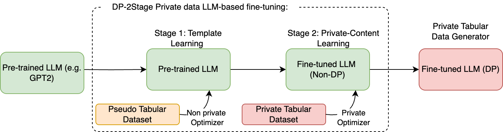

# **DP-2Stage: Adapting Language Models as Differentially Private Tabular Data Generators**

[](LICENSE)
[](https://www.python.org/)
[](https://pytorch.org/)



***Overview of DP-2Stage.** In stage 1, the pre-trained LLM is fine-tuned on the respective pseudo data.
Subsequently, in stage 2, the model from stage 1 undergoes further fine-tuning using the real private data*

This repository contains the implementation for [DP-2Stage](https://openreview.net/forum?id=6nBIweDYzZ&noteId=nqBVYO1mmd), a two-stage fine-tuning framework for differentially private tabular data generation (Published at TMLR 2025).

*Authors: Tejumade Afonja, Hui-Po Wang, Raouf Kerkouche, and Mario Fritz*

Contact: Tejumade Afonja ([tejumade.afonja@cispa.de](mailto:tejumade.afonja@cispa.de))

## Requirements
This implementation is based on [PyTorch](https://www.anaconda.com/download/) (tested for version 2.5.1). Please refer to [requirements.txt](requirements.txt) for the other required packages and version.  


## **Environment Setup**

1. Set the `PYTHONPATH`:
   ```bash
   export PYTHONPATH=$PWD
   ```

2. Create and activate the project environment:
   ```bash
   conda create -n dp2stage python=3.9
   conda activate dp2stage
   ```

3. Install dependencies:
   ```bash
   pip install -r requirements.txt
   ```

## **Data Preparation**

### Download the Dataset
To download the **Adult** dataset:
```bash
python download_dataset.py -name adult --train_subset 30932 --valid_subset 1000 --split_by_seed --seed 1000 --use_full_dataset
```

For the **Airline** dataset:
1. Create a [Kaggle account](https://www.kaggle.com/).
2. Generate an API key and save it to `~/.kaggle/kaggle.json`.
```bash
python download_dataset.py -name airline --train_subset 103904 --valid_subset 1000 --split_by_seed --seed 1000 --use_full_dataset
```

### Create Pseudo Data (Stage 1 Training)
To generate independent uniform pseudo data for the Adult dataset:
```bash
python utils/create_independent_uniform_pseudo_data.py \
    --dataset_path ./data/adult/k1000/train.csv \
    --seed 1000 \
    --output_dir ./data/adult-uniform/k1000 \
    --output_name train \
    --n_synth_samples 30932
```

## **Training and Sampling**

### Run Training and Sampling
Edit the necessary configuration in the scripts, then execute:

For example, to run the *out-distribution* pseudo data experiment for adult dataset, modify the configuration scripts linked in `scripts/run/adult/ood.sh`, then execute:
```bash
bash scripts/run/adult/ood.sh
```

## **Evaluate Synthetic Data**

To evaluate the synthetic data, modify the path to the generated data in `scripts/tabular_metrics.py`, and then run:
```bash
bash scripts/tabular_metrics.sh
```


## **Baselines**

To run the **SmartNoise** baseline models:
1. It is recommended to create a separate environment due to dependency conflicts:
   ```bash
   conda create -n smartnoise python=3.9
   conda activate smartnoise
   ```

2. Install the baseline dependencies:
   ```bash
   pip install -r requirements.txt
   pip install smartnoise-synth
   ```

Alternatively, you can revert the `opacus` version to match this project's requirements by reinstalling dependencies from `requirements.txt`.

To run the baselines, modify the `scripts/baseline.sh` as needed, and the run:
```bash
bash scripts/baselines.sh
```


## Citation
```bibtex
@article{
afonja2025dpstage,
title={{DP}-2Stage: Adapting Language Models as Differentially Private Tabular Data Generators},
author={Tejumade Afonja and Hui-Po Wang and Raouf Kerkouche and Mario Fritz},
journal={Transactions on Machine Learning Research},
year={2025},
url={https://openreview.net/forum?id=6nBIweDYzZ},
}
```
